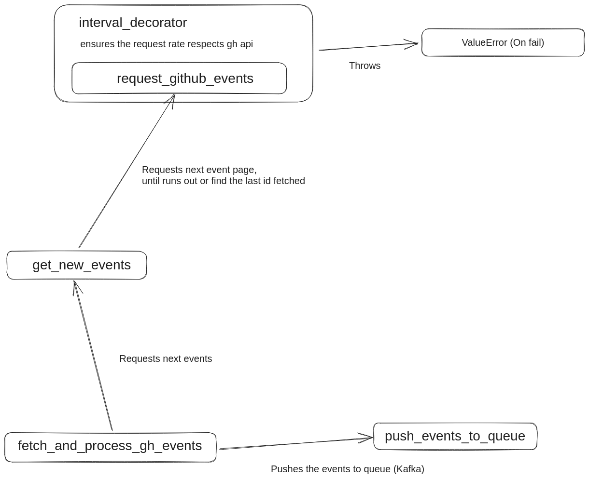
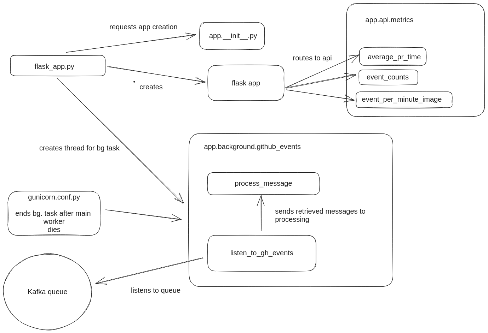

## How to run
Make sure you have docker and docker-compose installed on your machine. Then run the following command:
```
docker-compose up
```

## How to stop
```
docker-compose down
```

## How to run tests
Since we have two services, we need to run tests for each service separately. To run tests for API service, run the following command:
```
cd endpoints && python -m unittest discover
```
Make sure you have the dependencies installed. To install the dependencies, run the following command:
```
pip install -r requirements.txt
```

## What does the api do?
It has docs, just run the app and go to localhost:5000/docs.

## Asumptions
- No authentication is needed for the API. We can add authentication later if needed.
- We deploy using Docker/Kubernetes.

## Design choices and assumptions
As can be seen from the folder layout the application is split into two services:
1. Github injector - responsible getting the data from github and inserting it into the queue.
2. API - responsible for getting the data from the queue, persisting it into the database and serving it to the user.


### Why splitting the application into two services?
By splitting into two services, we can achieve two things:
1. We can scale the two services independently. For example, if we have a lot of requests for the API, we can scale the API service without scaling the database service.
2. When one service fails the other service can still work. For example, if github injector fails, the user can still use the API to get the data from the database.
When API fails, the github injector can still insert data into the queue, which will be picked up by the API when it is back online.

### Why using a queue and not POSTing directly to the API?
When we use API POST and the API fails, we lose the data. When we use a queue, we can retry the request until it succeeds. We can also use a queue to throttle the requests to the API. Secondly, it doesn't seem like a good
idea to add a POST endpoint without authentication.

### Why not directly inserting into the database?
I don't really like it, because I think that only a single service should be
responsible for the data. We then have to solve the problem of how to
manage models and migrations.

### Why using sqlite?
Really simple to use and good enough for our purpose. We can easily switch to another database if needed since we use SQLAlchemy ORM.

### Github injectors specifics
The gh API provides us with multiple pages of the latest events. We thus try to walk over the pages until we reach the event with the id we already have already seen. Note that this can create duplicates. since the event pages are ever-moving. We also make sure that we don't query more often than gh api recommends. Lastly, we employ the etag mechanism to avoid querying the same page twice.

### How are data persisted?
We use a named volume to persist the data in docker.


## Code diagram
### Github injector


### API

